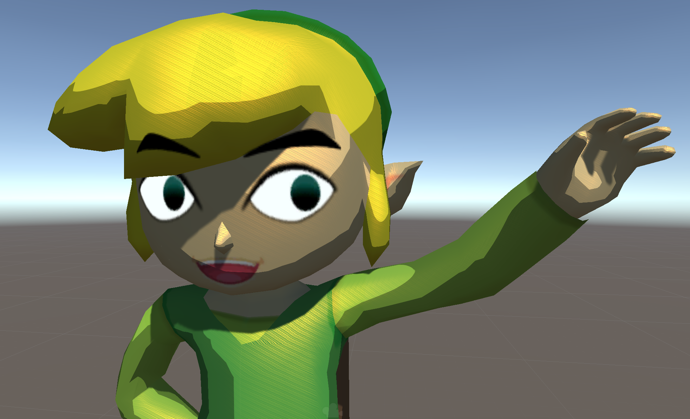

# Toon Standard Shader
## Adrian Biagioli

This shader is what I call the "Toon Standard" shader.  It is a Toon Shader that has a **configurable color ramp**, enabling Cel-shading, tinted color ramps, and otherwise nonlinear shading.  In addition, inspired by the Legend of Zelda Breath of the Wild, I also include the ability to **mask the specular channel in world space** with a small tiled texture, giving the appearance of hand-painted specular highlights.  **Shading parameters** (most importantly the color ramp) **are set globally**, so that you do not have to reconfigure all of your materials when you want to change any of these parameters.  Although it is a toon shader, my shader uniquely can **obey PBR principles of energy conservation**.  This means that artists can constrain the shading model such that the specular term is never overexposed, and also means that a Toon Standard-shaded object will appear to be just as bright as a (non-toon) Standard-shaded object with the same Albedo + Specular maps.  Finally, the Toon Standard shader is **fully compatible with Unity lightmaps, light probes, realtime shadows, and baked shadowmaps**.  This means that the Toon Standard shader is a drop-in replacement for the Standard shader and can easily be integrated into existing projects.  In my opinion, it is the definitive production-ready Toon Shader.

## Usage

This Shader was written for Unity 2019.2.  There are no especially new features used, but you may need to make minor changes to the shader files for the shader to work on older Unity versions.  To use, download the Unitypackage file from the releases page of this repository.  After importing the Unitypackage, navigate to the "Toon Standard" folder.  The `ToonStandardConfiguration` asset contains global configuration attributes for all Toon Standard materials.  Importantly, this is where you configure the shader's global color ramp.  You can also change the tiled hatch pattern used for specular highlights here.

Next, when creating a new material, set it to the `Toon Standard` shader.  You should be all set!
